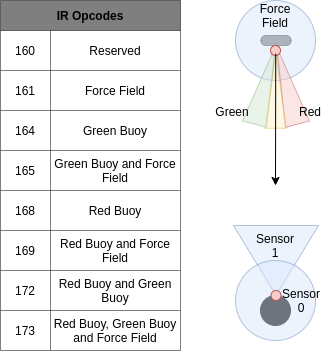

# Create3 Docking

The Create3 robot is equipped with a docking station to recharge it between experiments.

Through the ROS 2 APIs users can command docking and undocking autonomous behaviors.

Note that, in order for the robot to detect the dock, determine its location and understand when it is succesfully docked, it is necessary that the docking station is connected to a power source.

## Built-in docking behaviors

#### Undocking

You can command the robot to undock using the following ROS 2 action.

```bash
ros2 action send_goal /undock irobot_create_msgs/action/Undock "{}"
```

The robot will move backward out of the dock and then it will rotate 180 degrees.

This action will fail if the robot is already undocked.

#### Docking

You can command the robot to dock using the following ROS 2 action.

```bash
ros2 action send_goal /dock irobot_create_msgs/action/DockServo "{}"
```

The robot will first search for the dock in its immediate surroundings.
Note that the action will fail if the robot is too far from the dock.
You can check if the dock is visible by subscribing to the `/dock` ROS 2 topic.

Then the robot will align with the dock and carefully drive onto it.

This action will fail if the robot is already docked.

## Docking sensor data

The Create3 robot exposes several docking-related information through its ROS 2 publications.
These should allow users to write their own algorithms taking into account the presence of the dock in the environment and even to write their own docking and undocking procedures.

#### IR opcodes

The Create3 docking station transmit several IR signals.
The Create3 robot is equipped with two different sensors that are capable of detecting them.



The robot will publish these signals in the `/ir_opcode` ROS 2 topic.
Each message will contain a time-stamped detection of one of those signals, including the identifier of the sensor that detected it.

#### Dock information

More high-level information is produced by the robot in the `/dock` ROS 2 topic.
Here it's possible to quickly know if the robot is able to see the dock from its current location and whether it is currently docked or not.
