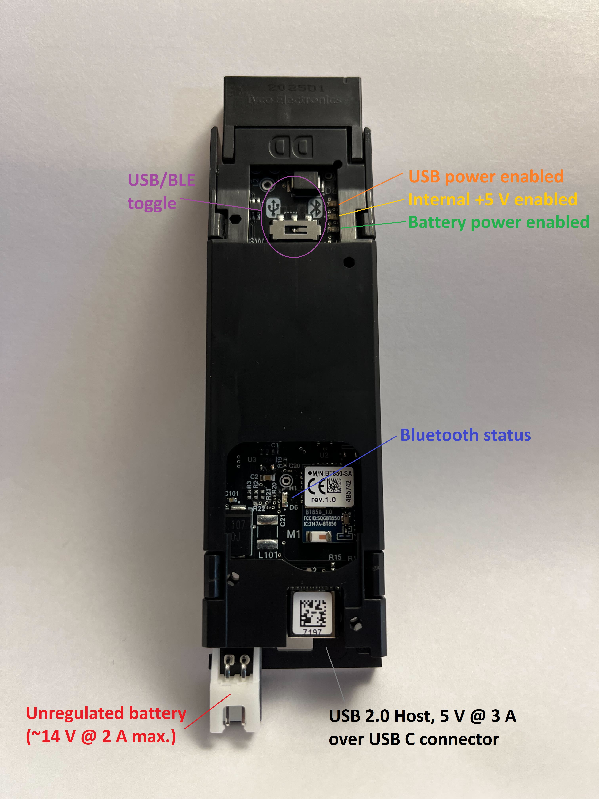

### iRobot® Create® 3 Electrical System

The iRobot Create® 3 robot has two electrical connections exposed via the Communication Board. The connections are accessible within the robot once the cargo bay is removed. The Communication Board is also visible through the top cover of the robot, where its indicators are visible, and the USB/BLE toggle can be switched.

The **unregulated battery port** is a JST XH-style connector, with pin 1 as the positive terminal of the battery, and pin 2 is the negative terminal. These terminals are labeled on the bottom side of the board and are visible with the robot on its back and the cargo bay removed. The board is capable of supplying a maximum of 2 A of current at the current battery voltage. The battery in the robot is a 26 Wh, 4S Lithium Ion smart battery pack, with a nominal voltage of 14.4 V.

The **USB C connector** provides a USB 2.0 Host connection into the robot with 5 V at 3 A provided to power downstream connections. The power is disabled on this port unless a proper USB C downstream device is connected. The USB data connection is made only when the USB/BLE toggle switch plunger is slid toward the USB icon.

The **USB/BLE toggle** routes the robot's single USB Host connection either to the USB C port (useful for connecting to single-board computers with OTG or device ports) or to the on-board BLE module. This module can be used to interact with the [iRobot Coding app](https://code.irobot.com).

The **orange indicator (D3)** is illuminated when the USB C port is powering a downstream device, whether or not a data connection is being made.

The **yellow indicator (D2)** is illuminated when the robot's internal 5 V bus is enabled. There is an error if this LED is extinguished.

The **green indicator (D300)** is illuminated when the robot's battery is switched on.

The **blue indicator (D6)** is illuminated when the BLE radio is turned on. It flashes when it is connected to a host.