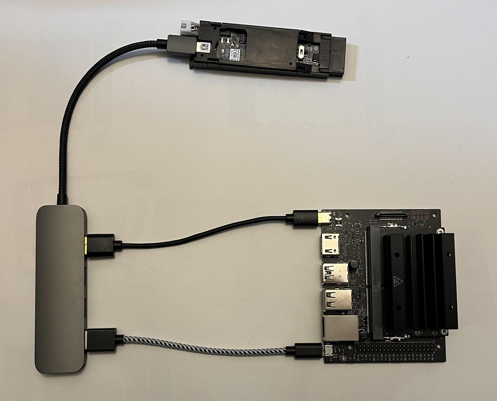
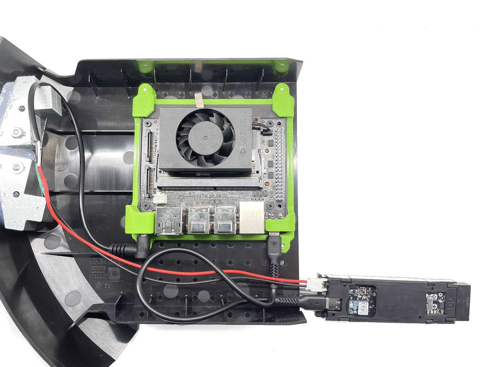

# iRobot® Create® 3 Hookup Guide

The iRobot® Create® 3 has a USB-C® connector implementing a USB 2.0 host capable of 5 V @ 3 A continuous, which can be used to power and communicate with various downstream devices.
Here are some hookup examples.

## Raspberry Pi®
The Raspberry Pi® mounting scheme does not match Create® 3's faceplate or cargo bay hole pattern; here are two 3D-printable mounts.
The larger mount is more rigid but requires three times as much time to print.

* [Small Mount (128kB)](data/C3-RPi-Mount-Small-20211022.stl)
* [Large Mount (520kB)](data/C3-RPi-Mount-20211022.stl)

### Raspberry Pi® 4
Since the Raspberry Pi® 4 has a USB-C® port capable of an OTG connection, a cable with a USB-C® connector on both ends is all that is required.
The Raspberry Pi® is pictured in the cargo bay with the large mount, and the Adapter Board is removed from the robot for clarity.

### Raspberry Pi® 1-3 Model B
The original Raspberry Pi® through the Raspberry Pi® 3 do not have upstream (device) ports, so it's a little more difficult to connect and power them cleanly.
We suggest using a USB-C® hub which includes an integrated USB to Ethernet adapter as the cleanest way to go.

It's also possible to power the Raspberry Pi® using the USB-C® port on the Adapter Board with the help of a downstream connection adapter like [this one](https://www.adafruit.com/product/4090) and make the data connection over Wi-Fi.

### Raspberry Pi® Zero
This should be the same as the Raspberry Pi® 4.
The Micro-USB connector labeled "USB" is an OTG port capable of being an Ethernet Gadget; use a USB Micro B to USB-C® cable to connect it directly to the robot's Adapter Board.

## NVIDIA® Jetson Nano™ 2GB
The Jetson Nano™ 2GB has a USB-C® port (J2) for power and a USB Micro-B port (J13) for downstream data.
This can be connected to the Create 3 most simply using a USB-C® hub and two cables -- USB A to Micro-B and USB A to USB-C®.

## NVIDIA® Jetson Xavier NX Developer Kit
The [Jetson Xavier NX Developer Kit](https://developer.nvidia.com/embedded/jetson-xavier-nx-devkit) has a 5.5mm x 2.5mm barrel connector jack (`J16`) for power (9V to 20V) and a USB Micro-B port (`J5`) for downstream data. 
This can be powered from the unregulated battery port of the Create® 3  adapter board by using a JST-XH female connector to DC barrel plug cable.
The data connection is established by using a USB Micro B to USB-C® cable.

You can 3d print the [mount adapter](data/C3-JetsonXavierNX-Mount_CSI-down.3mf) to place the Jetson Xavier NX Developer Kit in the cargo bay using 4x M3 screws.

USB-C® is a trademark of USB Implementers Forum. Raspberry Pi is a trademark of Raspberry Pi Trading. NVIDIA and Jetson Nano are trademarks or registered trademarks of NVIDIA Corporation. All other trademarks mentioned are the property of their respective owners.
