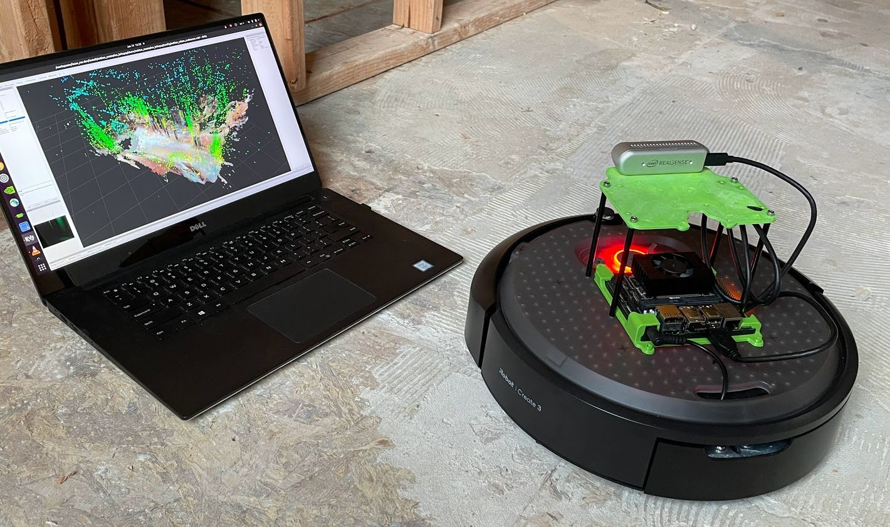

# iRobot® Create® 3 Hookup Guide for NVIDIA® Jetson™

The iRobot® Create® 3 robot has a JST XH-style connector on its internal [Adapter Board](./adapter.md) which is capable of supplying a **maximum of 2A** of curret at the current battery volrage (14.4V nominal).

The iRobot® Create® 3 robot has a USB-C®[^1] connector implementing a USB 2.0 host capable of 5 V @ 3 A continuous, which can be used to power and communicate with various downstream devices.

Here are some hookup examples for NVIDIA® Jetson™[^2] computers.

## NVIDIA® Jetson Orin Nano™ Developer Kit

!!! note 

    ### Hookup kit
    
    Below lists the content of an example kit that enables mounting Jetson Orin Nano Developer Kit with some sensors like Intel®  RealSense™[^3].

    - Jetson Orin Nano Developer Kit
    - Custom power cable (JST-HX to DC 5.5-2.5mm plug)
        - [DC power plug (5.5mm x 2.5mm)](https://a.co/d/cfNWywP)
    - [USB data cable (**USB-C® to USB-C®**)](https://a.co/d/7H62wsI)
    - Jetson NX-style developer kit mount ([STL file](./data/models/Compute/NVIDIA_Jetson/Adapter_Mount/C3-JetsonXavierNX-Mount.stl))
    - Sensor mount plate (STL file)
    - [M3 standoff/spacer x4](https://a.co/d/f1QWGB3)
    - M3 screws
    
The [Jetson Orin Nano™ Developer Kit](https://www.nvidia.com/en-us/autonomous-machines/embedded-systems/jetson-orin/) has a 5.5mm x 2.5mm barrel connector jack for power (9 V to 20 V) and a **USB-C® port** for upstream data. 
This can be powered from the unregulated battery port of the Create® 3  adapter board by using a JST-XH female connector to DC barrel plug cable.

## NVIDIA® Jetson Xavier NX™ Developer Kit

!!! note 

    ### Hookup kit
    
    Below lists the content of an example kit that enables mounting Jetson Xavier NX Developer Kit with some sensors like Intel®  RealSense™[^3].

    - Jetson Xavier NX Developer Kit
    - Custom power cable (JST-HX to DC 5.5-2.5mm plug)
        - [DC power plug (5.5mm x 2.5mm)](https://a.co/d/cfNWywP)
    - [USB data cable (USB Micro-B to USB-C®)](https://a.co/d/dnlCj1d)
    - Jetson Xavier Developer Kit mount ([STL file](./data/models/Compute/NVIDIA_Jetson/Adapter_Mount/C3-JetsonXavierNX-Mount.stl))
    - Sensor mount plate (STL file)
    - [M3 standoff/spacer x4](https://a.co/d/f1QWGB3)
    - M3 screws
    
The [Jetson Xavier NX™ Developer Kit](https://developer.nvidia.com/embedded/jetson-xavier-nx-devkit) has a 5.5mm x 2.5mm barrel connector jack (J16) for power (9 V to 20 V) and a USB Micro-B port (J5) for upstream data. 
This can be powered from the unregulated battery port of the Create® 3  adapter board by using a JST-XH female connector to DC barrel plug cable.

The data connection is established by using a USB Micro B to USB-C® cable, which requires some software tweaking to allow the Create3-to-Jetson communication. See [this page](../setup/jetson.md).

## How to mount

### Mount bracket for NVIDIA® Jetson NX-style developer kits

A mount bracket can be used to mount either Jetson Orin Nano™ Developer Kit or Jetson Xavier NX™ Developer Kit on the Create® 3 faceplate or in the cargo bay..

You can 3d print the [mount bracket](../print_compute/#mount-bracket).

!!! note
    - If you are 3d printing the above [mount bracket](../print_compute/#mount-bracket), use **support** to support overhang areas.
    

      
Slicing example

      </img>
    

    - You need four (4) M3 x 6mm screws; cap head is suggested.

### Printable sensor mount plate
You can 3d-print the sensor mount plate.

To fix the plate at a raised height, you can use M3 spacers like [this](https://a.co/d/f1QWGB3) to allow the sensor to have unobstracted view.

## NVIDIA® Jetson Nano™ 2GB
The Jetson Nano™ 2GB has a USB-C® port (J2) for power and a USB Micro-B port (J13) for downstream data.
This can be connected to the Create 3 robot most simply using a USB-C® hub and two cables -- USB A to Micro-B and USB A to USB-C®.

[^1]: USB-C® is a trademark of USB Implementers Forum.
[^2]: NVIDIA and Jetson are trademarks or registered trademarks of NVIDIA Corporation.
[^3]: Intel and RealSense are trademarks or registered trademarks of Intel Corporation.
[^4]: All other trademarks mentioned are the property of their respective owners.
