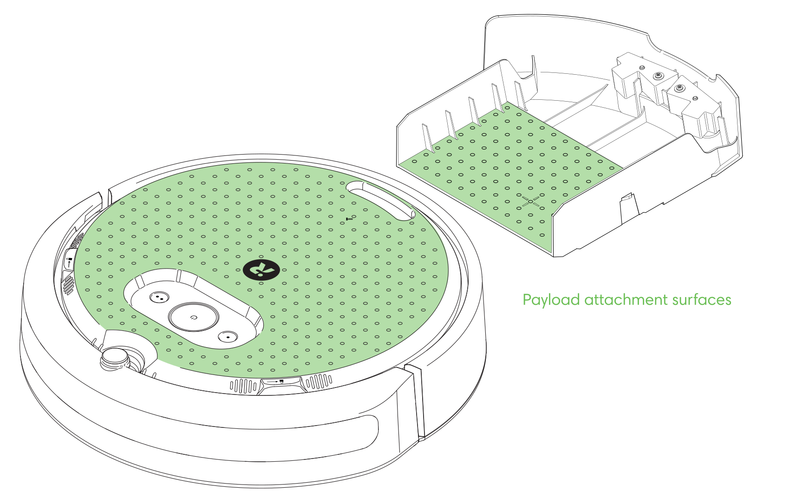
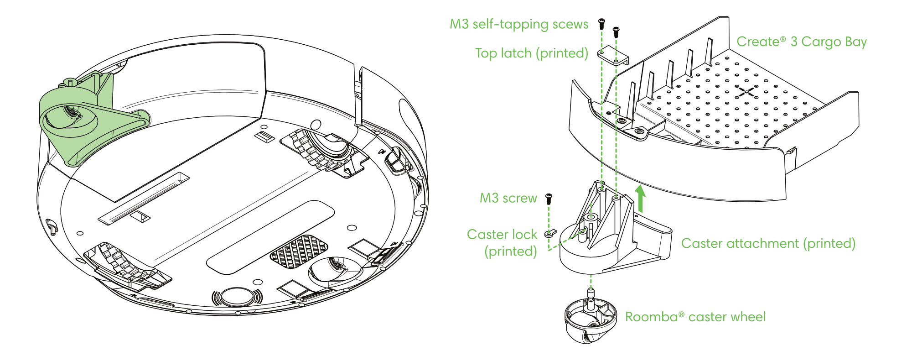
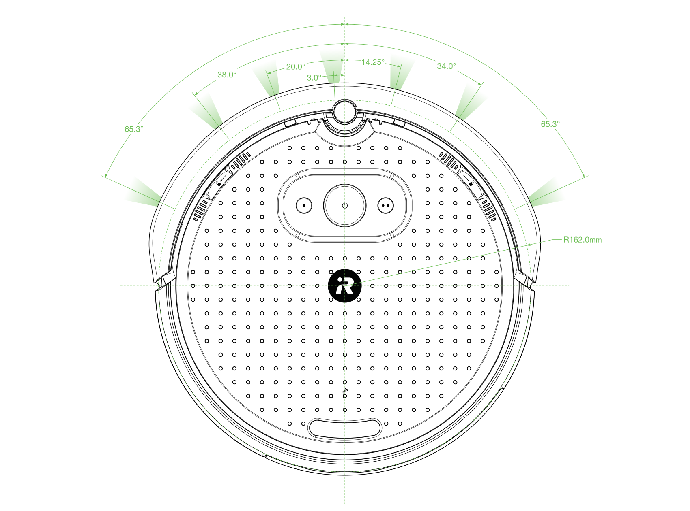

# iRobot® Create® 3 Mechanical System

The Create® 3 is a differential drive robot designed for traversing relatively-flat, indoor environments.
The drive wheels feature independent suspensions to help the robot overcome typical carpet or door thresholds.

## Payload

Sensors or accessories can be attached to the faceplate or internal cargo bay, both of which feature a regular 12 mm grid of 3 mm diameter mounting holes.
The maximum recommended payload weight (without changing acceleration limits) is 9 kg directly above the center of gravity of the chassis.
The robot can handle more weight with reduced acceleration limits or careful management of the load.

!!! attention "Notice"
    To prevent damage to the robot or payload, ensure the faceplate and/or payload are well secured to the chassis before use.

## Removing or attaching the faceplate
The faceplate is removed by rotating it on the center axis of the robot using the thumb rests.
Four locating pins on the top cover are used to install and retain the faceplate.

!!! attention "Notice"
    Always remove the Create® 3 robot’s faceplate prior to dismantling, adjusting, altering, or affecting the faceplate at the risk of damaging the robot.

### Locking the faceplate
If you would like to lock the faceplate and prevent it from rotating, you may insert an M3 self-tapping screw or pin in the faceplate hole marked with the image of a screw (while the faceplate is attached).

## Attachment Tips and Tricks

### Self-tapping screws with bosses
The Create® 3 robot's holes are sized for M3 or #4 screws.
It is possible to use special self-tapping plastic screws (or in a pinch, sheet metal or wood screws) to screw through the cover into a 3D-printed boss.
Many of our example STLs use this technique.

### Machine screws with nuts
The Create® 3 robot's holes are sized for M3 or #4 screws.

### Cable ties
Cable ties (also known as zip ties) can be threaded through the 3 mm holes.
2.5 mm widths are common and fit nicely.

### Twist ties
Twist ties are a quick, cheap, and reusable way for holding wires or other non-structural pieces.

### Plastic Rivets
Push-in, split-shank plastic rivets (either for M3 or 0.115" holes) are fast and inexpensive ways to mount thin stock to the Create® 3 robot's faceplate.

### Highly sophisticated interlocking brick system
The typical toy brick has its studs spaced at 8 mm, while Create® 3's holes are spaced at 12 mm.
It is possible to place an [stud adapter mount](../print_generic/#stud-mount) into every other hole in order to connect toy bricks to the Create® 3.
We recommend printing at 100% infill.

## Adding sensors
A growing library of printable mounts for attaching sensors to the Create 3 robot using its 12 mm grid of 3 mm holes is available [here](../print_sensor_mounts/).

## Adding a rear caster
Out of the box, Create® 3  has a center of gravity in front of the two drive wheels and features an integrated front caster to act as a third point of contact.
If you add a payload that is heavy and/or causes the robot center of gravity to move behind the drive wheels, you may want to add a second caster wheel in the rear to prevent sliding along the back edge.
Below you will find designs for two, 3D-printable solutions which add a second [Roomba® caster wheel](https://store.irobot.com/default/parts-and-accessories/roomba-accessories/700-series/roomba-front-caster-wheel/4624869.html) to the rear of the Create® 3.

### Rear caster attachment
The first option is a smaller print (99 x 83 x 58 mm) that attaches to the rear of the Create® 3 cargo bay.
It is faster and simpler to build but protrudes 54 mm behind the rear of the robot, so it may not be suitable for situations were the robot needs to navigate tight spaces or in cluttered environments.

The rear caster attachment is held in place between the handle and cable passthrough of the cargo bay using a printed latch and two M3 or #4 self-tapping screws.
The Roomba® caster wheel is inserted into the bottom opening and held in place with a small locking piece which is then screwed into place.
If the caster does not rotate freely, sand or file the bearing surface along the caster's axis of rotation.

| Part | Quantity |
| --- | --- |
| [Roomba® caster wheel](https://store.irobot.com/default/parts-and-accessories/roomba-accessories/700-series/roomba-front-caster-wheel/4624869.html) | 1 |
| [Rear caster attachment](../print_casters/#rear-caster-attachment) | 1 |
| [Caster lock](../print_casters/#caster-lock) | 1 |
| [Top latch](../print_casters/#rear-caster-attachment-latch) | 1 |
| M3 or #4 self-tapping screw | 3 |

### Cargo bay with integrated caster
The second option replaces the included Cargo Bay with one that contains an integrated rear caster.
It requires a larger print volume (208 x 201 x 66 mm) and slightly reduces the cargo space, but the solution does not protrude beyond the back of the robot.
This allows the robot to turn in tight spaces and reduces the likelihood of the caster attachment getting caught on objects in the environment.

To assemble, insert the Roomba® caster wheel through the bottom and hold it in place with the printed caster lock which is secured with an M3 self-tapping screw.
Depending on your payload weight and distribution, you may also want to transfer the ballast from the included Create® 3 cargo bay to this new one.

| Part | Quantity |
| --- | --- |
| [Roomba® caster wheel](https://store.irobot.com/default/parts-and-accessories/roomba-accessories/700-series/roomba-front-caster-wheel/4624869.html) | 1 |
| [Cargo bay with caster](../print_casters/#cargo-bay-with-caster) | 1 |
| [Caster lock](../print_casters/#caster-lock) | 1 |
| Ballast and M2.6X6 screw from Create® 3 Cargo Bay | 2 |
| M3 or #4 self-tapping screw | 1 |

## Downloadable 3D Model

Download this [STEP model (17.8 MB)](data/iRobot_Create_3_Public_Model.step)[^1] to help design attachments or payloads for Create® 3.
[^1]: Copyright © 2021-22 iRobot Corporation. All Rights Reserved.

## Dimensioned Drawings

### Top with Faceplate Attached

### Top with Faceplate Removed

### Side View

Wheel travel is approximately 30 mm.

### Bottom View

### Cargo Bay - Top

### IR Proximity Sensors

