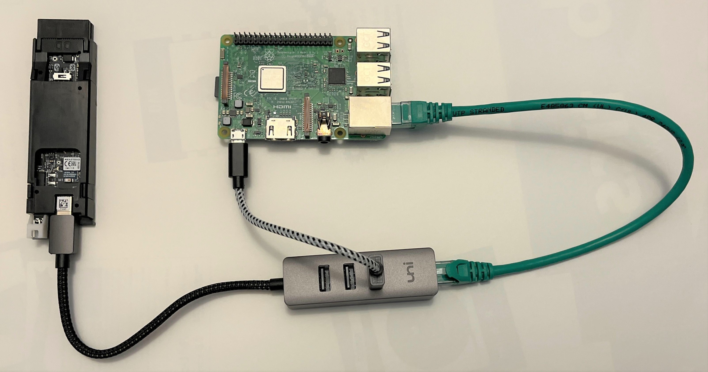

# iRobot® Create® 3 Hookup Guide for Raspberry Pi®

The iRobot® Create® 3 robot has a USB-C®[^1] connector implementing a USB 2.0 host capable of 5 V @ 3 A continuous, which can be used to power and communicate with various downstream devices.
Here are some hookup examples for Raspberry Pi®[^2] computers.

## Raspberry Pi® 4
Since the Raspberry Pi® 4 has a USB-C® port capable of an OTG connection, a cable with a USB-C® connector on both ends is all that is required.
The Raspberry Pi® is pictured in the cargo bay with the [large mount](#large-mount), and the Adapter Board is removed from the robot for clarity.

## Raspberry Pi® 1-3 Model B
The original Raspberry Pi® through the Raspberry Pi® 3 do not have upstream (device) ports, so it's a little more difficult to connect and power them cleanly.
We suggest using a USB-C® hub which includes an integrated USB to Ethernet adapter as the cleanest way to go.

It's also possible to power the Raspberry Pi® using the USB-C® port on the Adapter Board with the help of a downstream connection adapter like [this one](https://www.adafruit.com/product/4090) and make the data connection over Wi-Fi.

## Raspberry Pi® Zero
This should be the same as the Raspberry Pi® 4.
The Micro-USB connector labeled "USB" is an OTG port capable of being an Ethernet Gadget; use a USB Micro B to USB-C® cable to connect it directly to the robot's Adapter Board.

## Raspberry Pi® Printable Mounts
The Raspberry Pi® mounting scheme does not match Create® 3's faceplate or cargo bay hole pattern; here are two 3D-printable mounts.
The larger mount is more rigid but requires three times as much time to print.

### Small Mount
* [Small Mount STL (130.1 kB)](data/brackets/C3-RPi-Mount-Small-20211022.stl)

### Large Mount
* [Large Mount STL (532.9 kB)](data/brackets/C3-RPi-Mount-20211022.stl)

[^1]: USB-C® is a trademark of USB Implementers Forum.
[^2]: Raspberry Pi® is a trademark of Raspberry Pi Trading.
[^3]: All other trademarks mentioned are the property of their respective owners.
