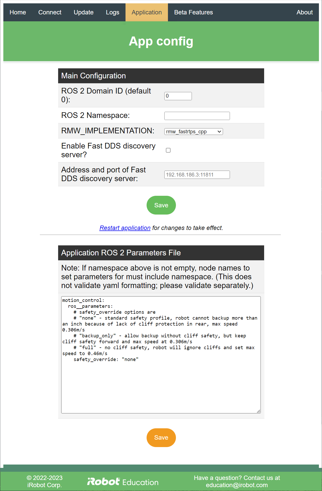

# iRobot® Create® 3 Webserver - Application
The Application menu normally has two options: "Configuration" and "Restart Application."
When the robot is acting as an access point, a third option, "Reboot robot," appears.

## Restart Application
Clicking "Restart Application" will restart the robot's ROS 2[^1] application.
This will take a few seconds to complete.
Restarting the application is necessary after modifying ROS 2 configuration settings.
Restarting the application will not restart the webserver; they are separate applications.

## Reboot Robot
Clicking "Reboot Robot" will completely reboot the robot.
This will take multiple minutes to complete.

## Application Configuration

There are two configuration sections on this page.
After saving either section, it is required to restart the application for changes to take effect.

### Main Configuration
The main configuration includes ROS 2 domain ID, namespace, and RMW Implementation.
Basic information about these settings can be found on this docs site both in the [ROS 2 Network Configuration](../setup/xml-config/) and [Multi-Robot Setup](http://localhost:8000/setup/multi-robot/) pages.
Further details on these settings can be found in the official ROS 2 documentation.

### Application ROS 2 Parameters File
This is a raw yaml file used for configuring ROS 2 parameters.
The web server will not validate this yaml file; setting it incorrectly may cause the application to fail to start properly.
Details of this will be found in the [logs](../webserver/logs.md).
If this happens, the parameters file can again be edited and saved in the web server in order to correct the problem.
An official ROS 2 tutorial on parameters can be found [here](https://docs.ros.org/en/galactic/Tutorials/Beginner-CLI-Tools/Understanding-ROS2-Parameters/Understanding-ROS2-Parameters.html).

[^1]: ROS 2 is governed by Open Robotics
[^2]: All other trademarks mentioned are the property of their respective owners.